# Apple II Luggable

I found this luggable computer on marketplace the other week. I initially dismissed it as it appeared to be in rough shape. Other people must have thought the same as the next morning I came across it again and it was still there! I started to take a closer look and saw a few card edge connectors, my first thought that it might have been an 8088 with 8-bit ISA slots, then I did a bit more research. It looked like it was an Apple II+ logic board! I couldn't resist, I sent the seller a message and an hour later I was driving to get it.
I had always wanted an Apple II. I had fond memories of playing Choplifter on my mates Apple II down the road when I was young. 

Here are some pics from the marketplace advert:

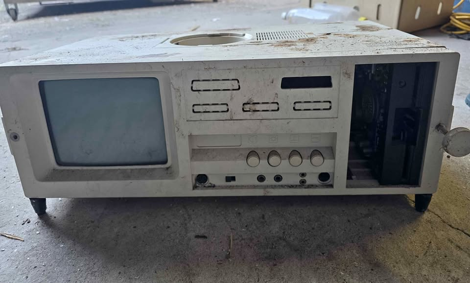
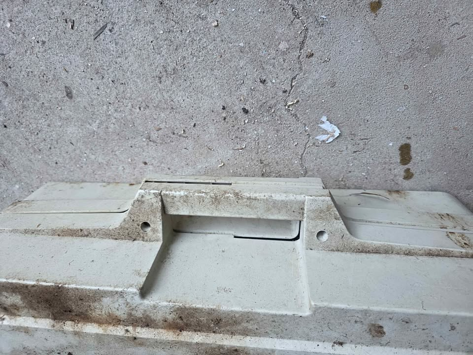
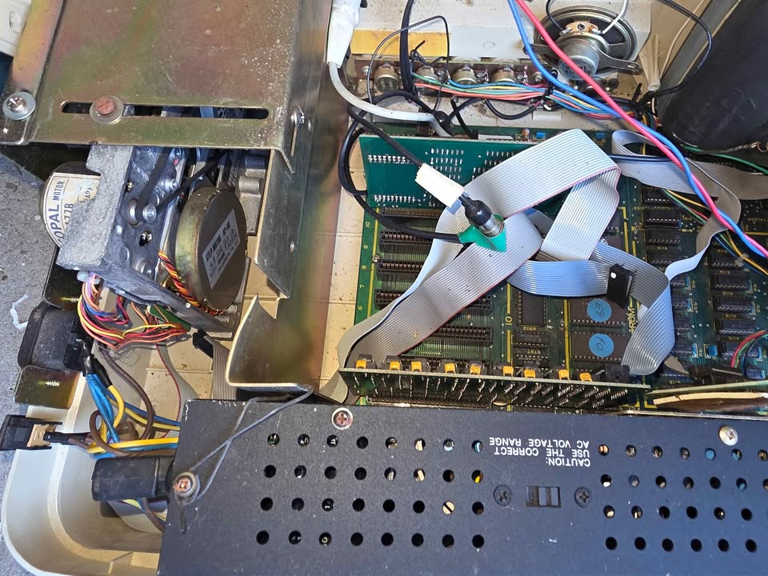
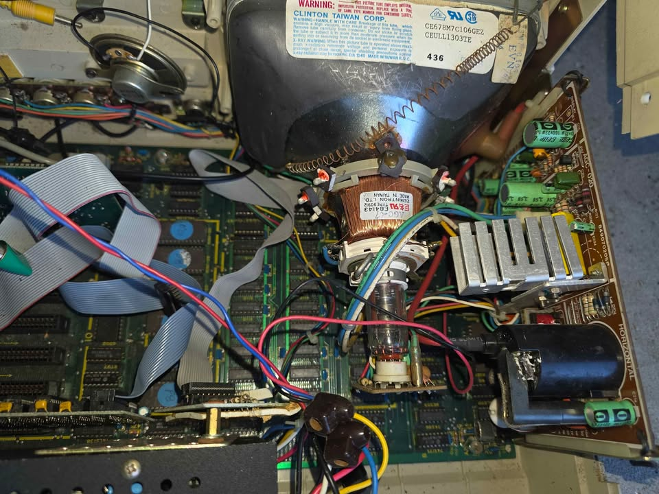
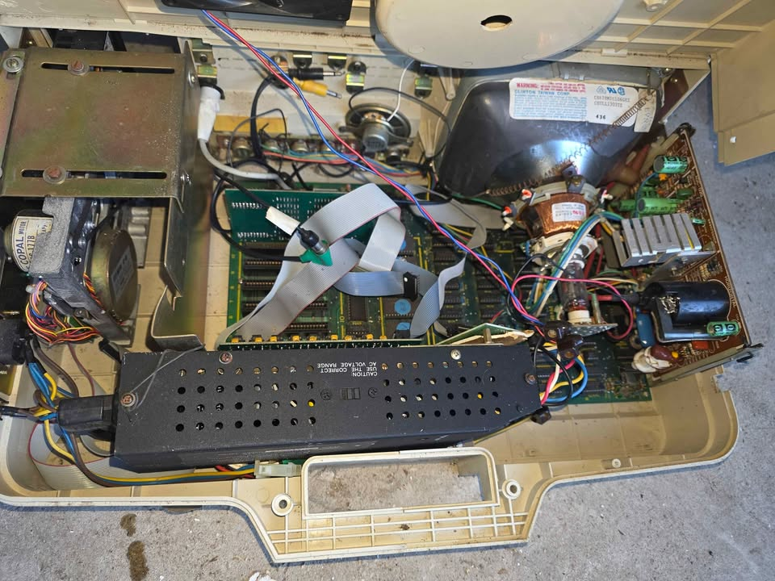
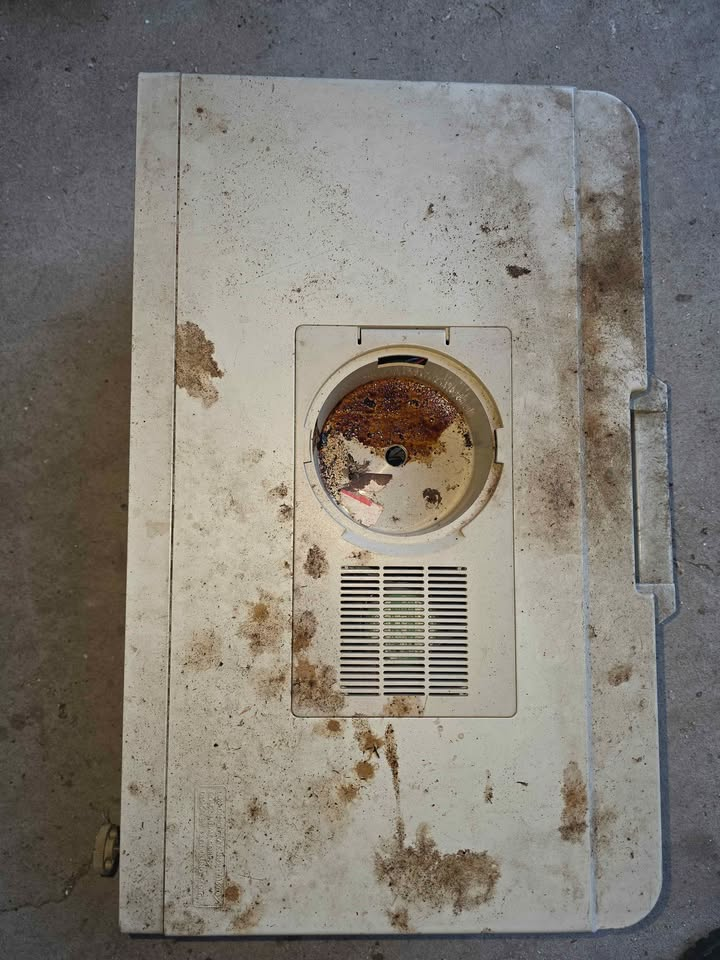

Over the next few days I started work on it.
Luckily the plastic was easy enough to clean with "Simple green" Adrian Black style ;)

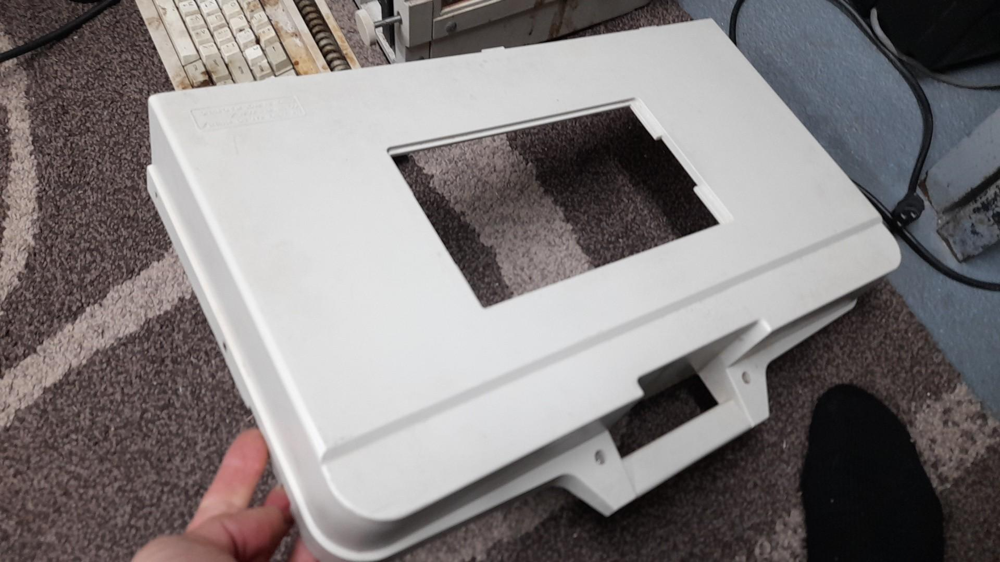
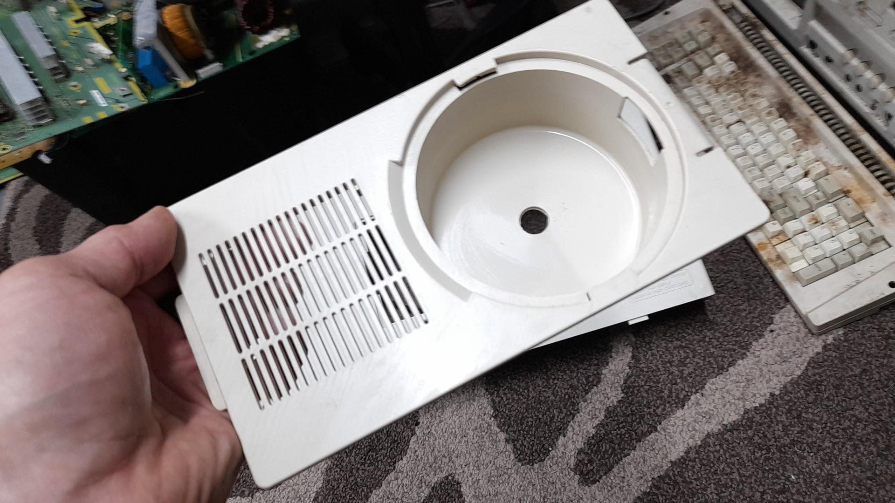

I was eager to test the CRT and had a hunch it was going to be amber, which would be the first in my CRT collection!

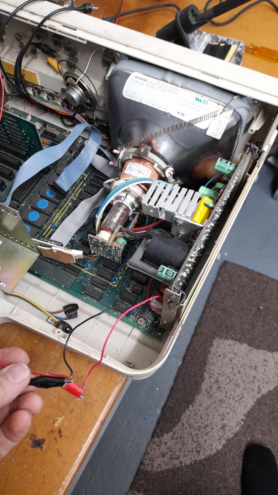
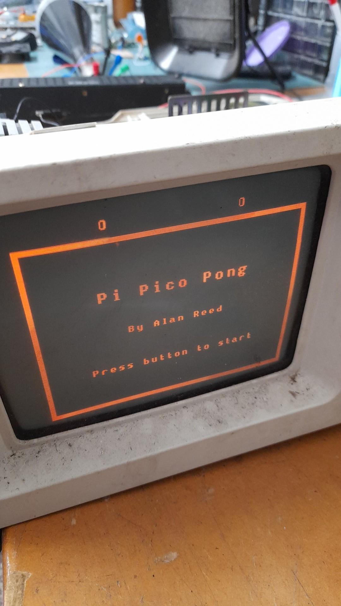

I had programmed up a Pi Pico a few days earlier to test out some other composite CRTs. After wiring up 12v it fired up without an issue! It was amber!

# The power supply

Next I decided to check out the power supply before powering it up, contrary to the stern warning not to open it. EVER! 

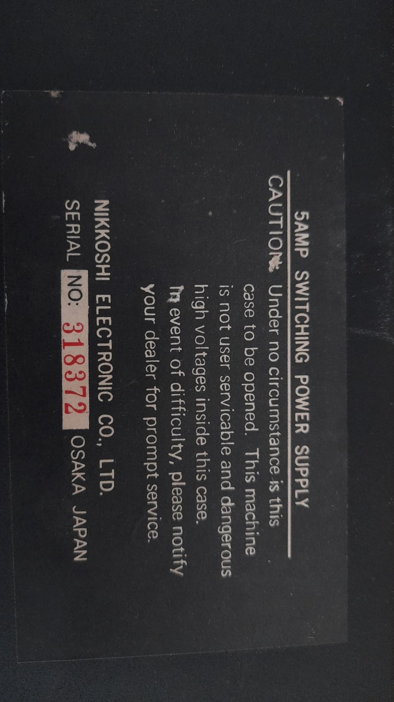

Luckily I have already come to terms with such warnings. I have a thing against arbitrary rules made for the but not for me, under the pretence of safety but usually ill-thought out. Surely a caution with the actual concern would be better, like capacitors may still be hold charge. But I digress! Onwards and upwards!

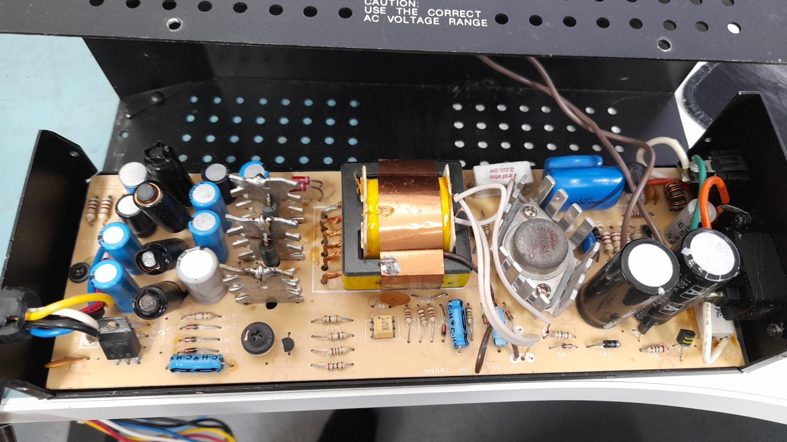

It looked better than I expected inside with no burny bits or bulging caps. An interesting note is how there a switch for mains input selection 110/220v. This switches the rectifier configuration for 110V to a voltage doubler config to produce the ~320V DC.

I decided to fire it up. While it didn't let the smoke it, it also wasn't happy. It kept cycling which you could hear audibly. A 10R resistor across the 12v rail supplied enough load to keep it happy and then all the rails checked out OK voltage wise.

# The logic board

After powering up the logic board, it was quite uneventful. By that I mean absolutely nothing happened, hah! After some probing around it turns out the 6502 processor was being held in reset. After not knowing much at all about the Apple II, I faced a rather rapid learning curve. The book "The Apple II Circuit Description" by W. Gayler, is an excellent resource! https://archive.org/details/apple-ii-circuit-description

It is at this point I realised my board was actually a clone board of the Apple II, while most of the schematics applied, there was some variation here and there. One of them was the keyboard. There is an adaptor board that converts from the external keyboard to the Apple II format electrically. There is also a reset signal that comes from the keyboard and the adaptor board has a pull-down resistor. Without the keyboard plugged in the CPU is held in reset! 

TO BE CONTINUED
