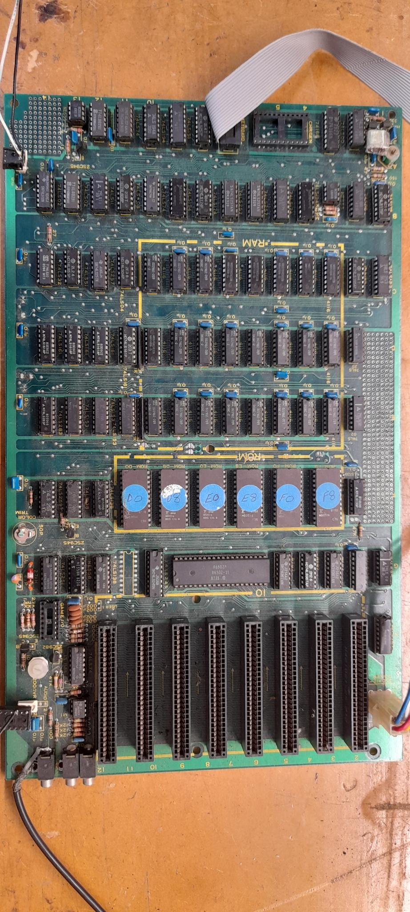
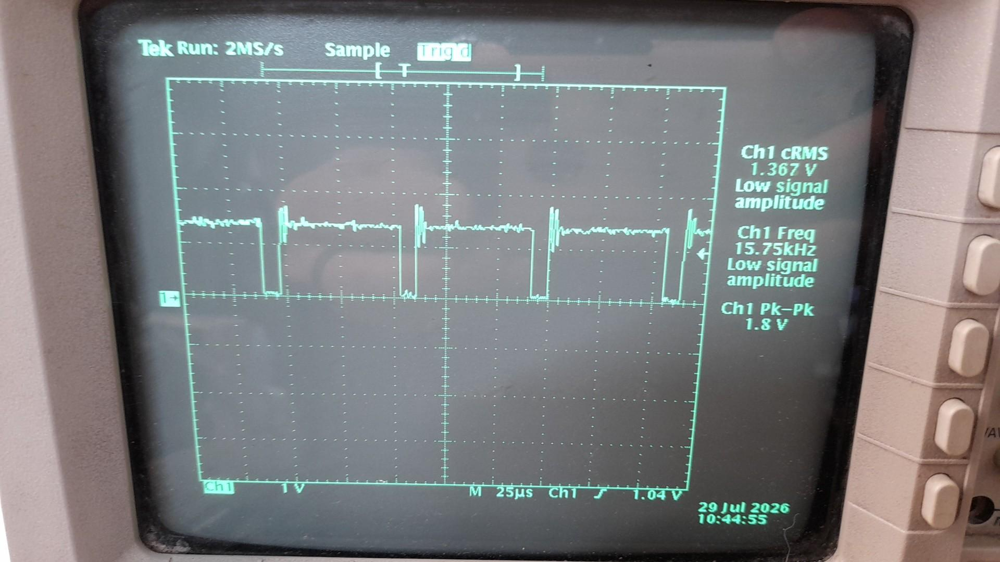
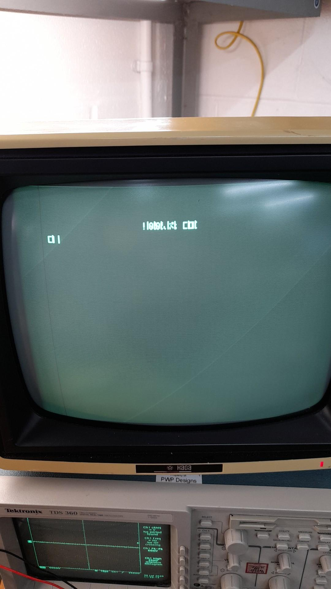
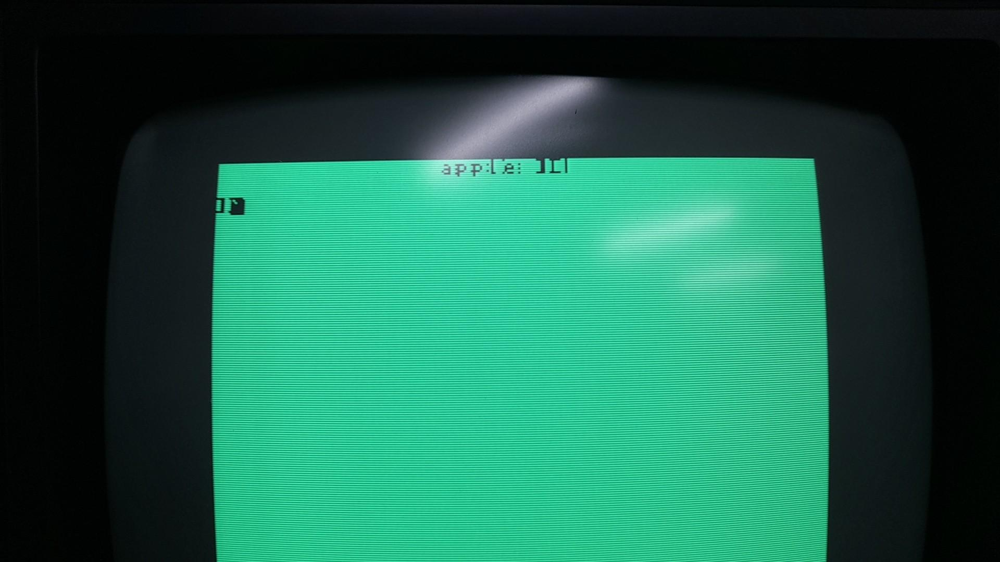
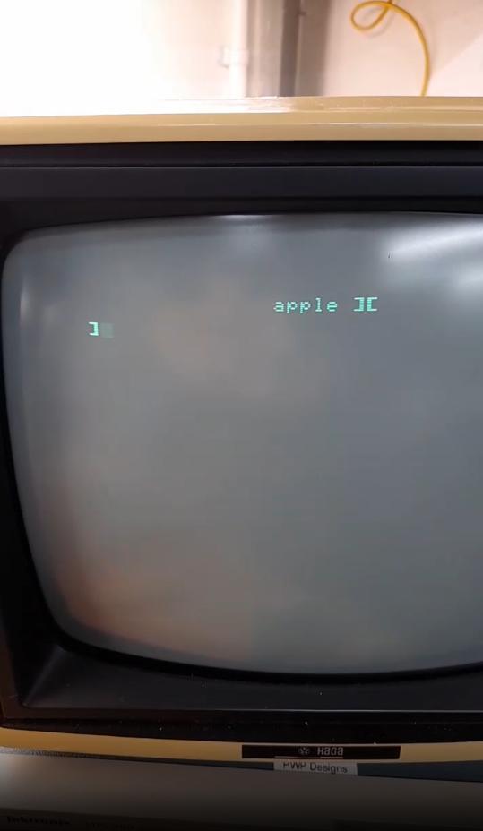

# Apple II Luggable

I found this luggable computer on marketplace the other week. I initially dismissed it as it appeared to be in rough shape. Other people must have thought the same as the next morning I came across it again and it was still there! I started to take a closer look and saw a few card edge connectors, my first thought that it might have been an 8088 with 8-bit ISA slots, then I did a bit more research. It looked like it was an Apple II+ logic board! I couldn't resist, I sent the seller a message and an hour later I was driving to get it.
I had always wanted an Apple II. I had fond memories of playing Choplifter on my mates Apple II down the road when I was young. 

Here are some pics from the marketplace advert:

Over the next few days I started work on it.
Luckily the plastic was easy enough to clean with "Simple green" Adrian Black style ;)

I was eager to test the CRT and had a hunch it was going to be amber, which would be the first in my CRT collection!

I had programmed up a Pi Pico a few days earlier to test out some other composite CRTs. After wiring up 12v it fired up without an issue! It was amber!

# The power supply

Next I decided to check out the power supply before powering it up, contrary to the stern warning not to open it. EVER! 

Luckily I have already come to terms with such warnings. I have a thing against arbitrary rules made for the but not for me, under the pretence of safety but usually ill-thought out. Surely a caution with the actual concern would be better, like capacitors may still be hold charge. But I digress! Onwards and upwards!

It looked better than I expected inside with no burny bits or bulging caps. An interesting note is how there a switch for mains input selection 110/220v. This switches the rectifier configuration for 110V to a voltage doubler config to produce the ~320V DC.

I decided to fire it up. While it didn't let the smoke it, it also wasn't happy. It kept cycling which you could hear audibly. A 10R resistor across the 12v rail supplied enough load to keep it happy and then all the rails checked out OK voltage wise.

# The logic board

After powering up the logic board, it was quite uneventful. By that I mean absolutely nothing happened, hah! After some probing around it turns out the 6502 processor was being held in reset. After not knowing much at all about the Apple II, I faced a rather rapid learning curve. The book "The Apple II Circuit Description" by W. Gayler, is an excellent resource! [https://archive.org/details/apple-ii-circuit-description]()

It is at this point I realised my board was actually a clone board of the Apple II, while most of the schematics applied, there was some variation here and there. One of them was the keyboard. There is an adaptor board that converts from the external keyboard to the Apple II format electrically. There is also a reset signal that comes from the keyboard and the adaptor board has a pull-down resistor. Without the keyboard plugged in the CPU is held in reset! 

After hacking the reset high for now (until I get around to fixing the keyboard - it is dead too), the CPU was attempting to run! The video generator circuit was already running (it runs independent to the CPU) but I was seeing nothing on the monitor, there was a sync signal but no signs of start-up, it looked like the CPU was resetting over and over.

Note the missing character ROM in the top right, that's a whole story on its own later.

At this point after mucking around for a while I noticed one of the DRAM chips was warmer than the rest, so I swapped it out with one from the language card which I had removed for now. To my surprise it started beeping at power on! This was great! Except it wasn't the normal startup beep, it kept repeating over and over like it was being reset! Atleast this was progress.

So I continued the investigation. After looking over the F8 ROM assembly code you could see where the code emits the beep from the speaker, the CPU had executed a bit of code to get to that point, which was encouraging. I started to take a look around the character generator ROM and it's address lines, they appeared to be working ok. At the time the unit had an EPROM in there with black insulation tape on it, which was a sure fire sign someone had had a go at it. 

After probing around I got to the 74LS74 flip-flop and I noticed it wasn't really doing what it should. I popped it out and put it in the T48 programmer to test it. Sure enough it failed. After replacing it with a new one, the CPU only gave one solid beep on startup!! Hooray! I think its working!! Except there is nothing on the screen!!!?? Oh no.

# The Character ROM debacle  

Now the CPU seems to be booting and running, I turned my attention back to the character ROM. The video generator in text mode constantly addresses the character ROM for output but all the output was 0's, odd!? I pulled the ROM (D2716) out and dumped it on the computer, to my dismay it revealed it wasn't blank (0xFF) it was zeroed! (0x00) What on earth, I still don't understand what had gone on here but maybe someone before zeroed it to help in their diagnosis (which the problem was the 74LS74). But where did that leave me?

Well this is where it gets interesting. This is a clone board and after trying the Apple II character ROM on a 2716 it sort of worked, you could see where the correct characters should be but they were jumbled! But atleast more progress!

So I tried the first 2K of a Apple IIe character ROM (these are 4K images). This was the result, a bit more encouraging. 

This is when I began to suspect the differences in the clone board. The way the ROM is wired to the shift register differs to the original Apple II+ board. With a bit of trial and error I ended up writing some python code to convert the original Apple II+ ROM to a character ROM that works on the clone board:

- [Original Apple II+ Character ROM](downloads/Apple II+ - Lowercase Character Generator - 2716.bin)
- [Corrected Apple II Clone Character ROM](downloads/appleii-clone-character-rom.bin)
- [ROM conversion script](downloads/conv.py)
- [ROM display script](downloads/disp.py)

I think one bit of the original ROM was also used to flag inversion but on mine it does not, it appears to be unused/NC (D0). There may be more work to do on this ROM but for now it seems to work OK, I might revisit it later. I created the display script to attempt to decode the corrected ROM as I got sick of erasing and burning ROMs!

Great success! Now I am going to need a keyboard. Note the lower case "apple". I discovered this when I dumped the F8 ROM intially. I wanted to know if I had a good ROM, the lower case "apple" and one other byte (I think a keyboard register!?) were the only differences in my clone ROM compared to the original Apple II+ ROM.

# The Keyboard

TO BE CONTINUED
