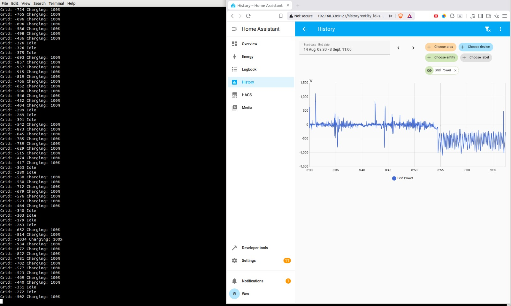
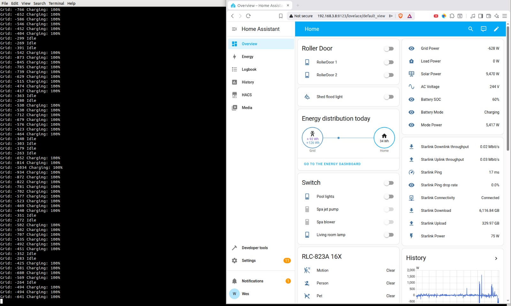

# Goodwe GW5048-EM as a managed 48V forklift charger

I have been using a  Goodwe GW5048-EM hybrid solar inverter as a managed 48V forklift battery charger for a while now. The charging is managed with a script that enables/disables the battery charging only according to the excess solar power so as to not charge from the grid.
# How it works

The grid power is read from the smart meter. If the grid export is over 500W then the forklift battery charging is enabled. The charger has an internal ramp, which takes a few seconds to reach full power. This is used to our advantage to give us time to throttle the charger. If there is insufficient export to cover the entire charge load, the grid export power will drop below 500W, this process may take a few seconds. At this point the charger is turned off and the charger internally ramps down over a few seconds. This is where the 500W grid export set point gives the process enough headroom to cover the overshoot so it does not draw from the grid.

Below is a graph of the grid power from Home Assistant showing the export power under charging with the charger being throttled due to insufficient export power to cover the entire charge load.

The 500W export power set point also means the house solar battery gets charge priority as well as the consumer side loads. It will soak up as much power as required to charge before it starts exporting to the grid.

# The nuts and bolts

A script (get_power.sh) reads the grid power through the fronius solar smart meter via the fronius solar inverter web interface. This script simply returns the power in watts for the grid consumption (-ve for export). You could modify this to suit your own system/grid inverter/smart meter.

	#!/bin/bash
	power=`wget -q http://192.168.3.10/components/PowerMeter/readable -O - | tr ',' ' ' | grep -oP '\"SMARTMETER_POWERACTIVE_01_F64\" : \K[^"]+'`
	printf "%0.0f" $power

Initially I implement a PID algorithm for the charging. After some experimentation, I concluded  simple thresholding and on/off control of the charging worked best (seemingly due to the internal ramping of the Goodwe 5048-EM).

Here is a copy of my gw_charge_managed.py script, including the evolution/commented out code:

	#!/usr/bin/python
	
	import asyncio
	import goodwe
	from subprocess import Popen, PIPE
	from simple_pid import PID
	import time
	from enum import Enum
	import sys
	
	
	async def get_runtime_data():
	
	#	await inverter._clear_battery_mode_param()
		await inverter._set_offgrid_work_mode(0)
		await inverter._set_limit_power_for_charge(0, 0, 0, 0, 0)	
		await inverter._set_limit_power_for_discharge(0, 0, 23, 59, 100)
		await inverter._set_work_mode(goodwe.OperationMode.ECO)
	
	
	
	ip_address = '192.168.3.16'
	
	inverter = asyncio.run(goodwe.connect(ip_address, family="EM", do_discover=False))
	
	asyncio.run(get_runtime_data())
	
	#pid = PID(0.1, 0.1, 0.0, setpoint=0) #10A
	#pid = PID(0.02, 0.01, 0.0, setpoint=0) #20A
	#pid = PID(0.05, 0.01, 0.0, setpoint=0) #20A
	pid = PID(10.0, 10.0, 0.0, setpoint=-400) #20A
	#pid = PID(10.0, 10.0, 0.0, setpoint=-1000) #20A
	pid.output_limits = (-100, 100)
	
	while True:
	
		try:
	
			output = Popen(["./get_power.sh"],stdout=PIPE)
			response = output.communicate()
			grid = int(response[0])
	
			percent = int(pid(grid))
	
			if percent > 0:
				print("Grid: " + str(grid) + " Charging: " + str(percent) + "%")
				asyncio.run(inverter._set_limit_power_for_charge(0, 0, 23, 59, percent))
				#asyncio.run(inverter._set_limit_power_for_charge(0, 0, 0, 0, 0))
				asyncio.run(inverter._set_limit_power_for_discharge(0, 0, 0, 0, 0))
			else:
				print("Grid: " + str(grid) + " Idle")
				asyncio.run(inverter._set_limit_power_for_charge(0, 0, 0, 0, 0))
				asyncio.run(inverter._set_limit_power_for_discharge(0, 0, 0, 0, 0))
	
			#	runtime_data = asyncio.run(inverter.read_runtime_data())
			#	print("Battery Current: " + str(runtime_data["ibattery1"]))
	
		except KeyboardInterrupt:
			print("\nProgram terminated by user.")
			sys.exit(0)
	
		except:
			pass

# Beyond charging: Using the forklift battery as a house battery

If you wanted to use your forklift battery to bolster your house battery capacity, I had also played around with a script that manages both charging and discharging. Of course this was just for experimentation and since my forklift battery is lead-acid, excessive cycling will lead to its rapid demise, so use this at your own risk. But here it is for completeness:

	#!/usr/bin/python
	
	import asyncio
	import goodwe
	from subprocess import Popen, PIPE
	from simple_pid import PID
	import time
	from enum import Enum
	import sys
	
	
	class Mode(Enum):
		CHARGING = 1
		DISCHARGING = 2
		WAITING = 3
	
	TIME_DELAY_SECONDS = 10*60
	
	ip_address = '192.168.3.16'
	
	
	
	
	async def get_runtime_data():
		await inverter._set_offgrid_work_mode(0)
		await inverter._set_limit_power_for_charge(0, 0, 0, 0, 0)	
		await inverter._set_limit_power_for_discharge(0, 0, 0, 0, 0)
		await inverter._set_work_mode(goodwe.OperationMode.ECO)
	
	
	
	inverter = asyncio.run(goodwe.connect(ip_address, family="EM", do_discover=False))
	
	asyncio.run(get_runtime_data())
	
	#pid = PID(0.1, 0.1, 0.0, setpoint=0) #10A
	#pid = PID(0.02, 0.01, 0.0, setpoint=0) #20A
	pid_charge = PID(10.0, 10.0, 0.0, setpoint=-500) #20A
	pid_discharge = PID(0.001, 0.001, 0.0, setpoint=0) #20A
	
	pid_charge.output_limits = (-100, 100)
	pid_discharge.output_limits = (-100, 100)
	
	last_change_time = time.time() - TIME_DELAY_SECONDS
	current_mode = Mode.WAITING
	
	
	while True:
	
		try:
			output = Popen(["./get_power.sh"],stdout=PIPE)
			response = output.communicate()
			grid = int(response[0])
	
			if grid < 0:
				if current_mode != Mode.CHARGING and time.time() - last_change_time >= TIME_DELAY_SECONDS:
					current_mode = Mode.CHARGING
			else:
				if current_mode != Mode.DISCHARGING and time.time() - last_change_time >= TIME_DELAY_SECONDS:
					current_mode = Mode.DISCHARGING
	
			remaining_time = TIME_DELAY_SECONDS - int(time.time() - last_change_time)
					
			if current_mode == Mode.CHARGING:
				# Charge mode
				percent = int(pid_charge(grid))
	
				if percent > 0:
					last_change_time = time.time()
					print("Grid: " + str(grid) + " watts	Charging: " + str(percent) + "%")
					asyncio.run(inverter._set_limit_power_for_charge(0, 0, 23, 59, percent))
					asyncio.run(inverter._set_limit_power_for_discharge(0, 0, 0, 0, 0))
				else:
					print("Grid: " + str(grid) + " watts	Charge Idle. " + str(remaining_time) + "s remaining")
					asyncio.run(inverter._set_limit_power_for_charge(0, 0, 0, 0, 0))
					asyncio.run(inverter._set_limit_power_for_discharge(0, 0, 0, 0, 0))
			else:
				# Discharging mode
				percent = int(pid_discharge(-grid))
	
				if percent > 0:
					last_change_time = time.time()
					print("Grid: " + str(grid) + " watts	Discharging: " + str(percent) + "%")
					asyncio.run(inverter._set_limit_power_for_charge(0, 0, 0, 0, 0))
					asyncio.run(inverter._set_limit_power_for_discharge(0, 0, 23, 59, percent))
				else:
					print("Grid: " + str(grid) + " watts	Discharge Idle. " + str(remaining_time) + "s remaining")
					asyncio.run(inverter._set_limit_power_for_charge(0, 0, 0, 0, 0))
					asyncio.run(inverter._set_limit_power_for_discharge(0, 0, 0, 0, 0))
	
		except KeyboardInterrupt:
			print("\nProgram terminated by user.")
			sys.exit(0)
	
		except:
			pass
